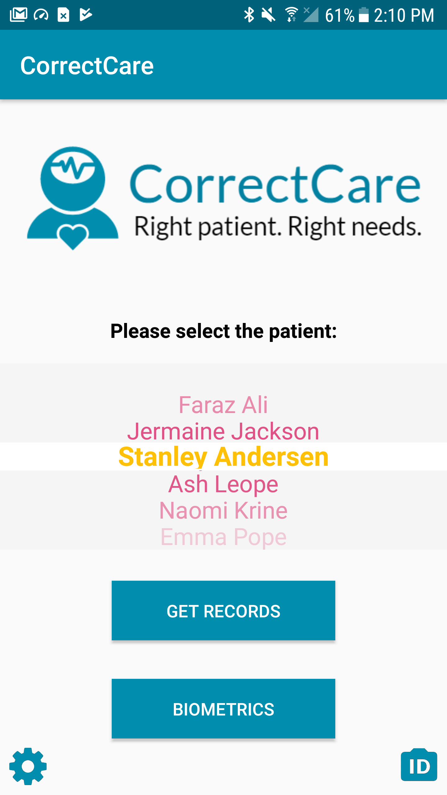
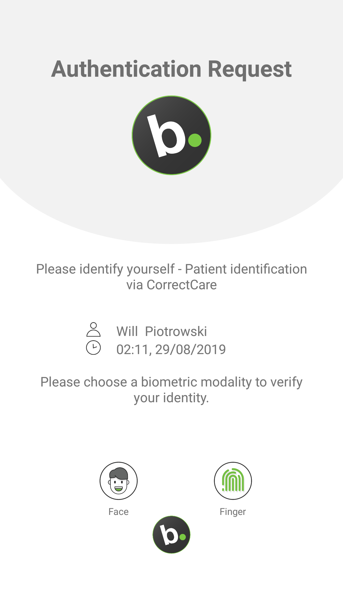
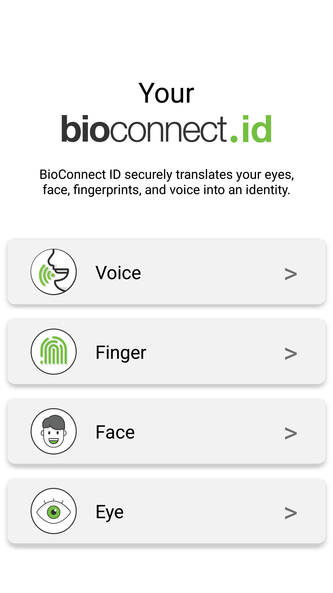

# CorrectCare
Retrieving patient records is a task that requires a high level of security to be present due to the sensitivity of the data. Currently, many healthcare systems are subject to data breach as a result of weak security infrastructure. To model a better, more robust system for this process, CorrectCare introduces biometric authentication to the task. Nurses are able to use the app to authenticate themselves before accessing patient records. The app also allows a nurse to use a patient's biometrics in order to identify them. This secondary feature was implemented to help combat issues such as misdiagnosis and wrong-site surgeries.

| Main Screen | Authentication Request |
| :--------: | :-------:  |
|  |  |
| **Patient Record** | **Patient Identification**  |
|  |  |

# Biometrics
Normally, sensitive data is accessed through the use of keys, fobs, pins, and passwords. Biometrics are much more secure for data access in this scenario as they are less likely to be replicated, stolen, lost, or intercepted in transmission as compared to regular security measures. With CorrectCare, a nurse is able to enroll and use four different biometrics to access records. Depending on the settings decided upon by the healthcare facility, a nurse can authenticate themselves using their face, eyes, fingerprint, and/or voice. 

>Note: With BioConnect as the biometric provider, at no point are images or recordings of any of the user's biometrics stored.

# Author

- Faraz Ali - Developer
- BioConnect - Biometric API
